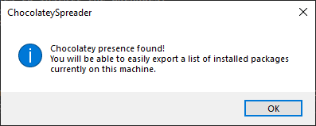
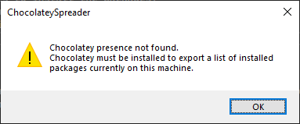

# ChocolateySpreader
An application to inject automatic package installers into Windows installation media to be executed as a post-install script.
This readme is under construction, and will be updated as the project progresses.

This application has only been tested with Windows 10 ISO's. It should work with Windows 11 ISO's as well.
This application has not been tested with Windows 7, or Windows 8 ISO's due to the fact that these operating systems have reached the end of their life.
There is no guarantee this program will work correctly with these operating system ISO's.

This application will also not not be able to generate ISO's that will work correctly on Ventoy enabled USB drives. Windows will still install, however the programs will not be installed automatically.

## System Requirements

To use this application, you will need at least the following:

- Windows 7 or later (64-bit)
- .NET Core 6 or later
- [7-Zip](https://7-zip.org)
- Windows Deployment Tools, found in the [Windows Assessment and Deployment Kit](https://aka.ms/windows/adk)
- (optional) Chocolatey, to enable the use of exporting the list of currently installed packages.

## How Does It Work?

This application inserts the following files into Windows installation files that allow the automatic installation of programs when the operating system is installed and the user lands on the desktop.
- OOBE.cmd: This file sets up RunOnceEx, which will call ChocolateyBaker with admin rights to install the packages.
- ChocolateyBaker: This will download the latest version of Chocolatey and install the packages located in packages.config.
Note that Chocolatey will install the version of the packages specified in packages.config.

## Usage

When the program starts, it will first check to see if Chocolatey is installed on your machine. This is to enable a feature to quickly export a list of installed packages on the machine.
If Chocolatey has been detected, then a message box will be displayed letting you know that you can quickly export a package list.

If Chocolatey was not detected, then a different message box will be displayed:

